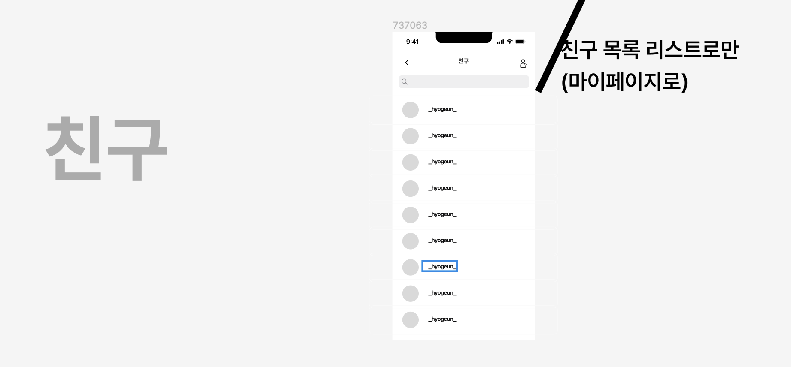

# NAGNE

---

## 기능 명세서

| 구분     | 상세 구분  | 기능     | 상세                                                                                                          | 우선순위 |
|--------|--------|--------|-------------------------------------------------------------------------------------------------------------|------|
| 온보딩    | 로그인    | 로그인    | 네이버, 카카오, 구글등 소셜로그인                                                                                         | high |
|        | 가입 페이지 | 닉네임 작성 | - 닉네임 작성                                                                                                    | low  |
|        |        | 관심 지역  | - 관심 지역 선택                                                                                                  | low  |
|        |        | 취향 선택  | - 여행 취향 선택                                                                                                  | low  |
| 첫화면    | 메인 페이지 | 메인 페이지 | -내 위치가 포함된 게시물 보여줌 -개시물은 지도에 경로표시와 다녀온 위치? 가게? 이름 표시 -해당 게시물을 스와이프 형식으로 넘길 수 있음 - 위치 검색할 수 있음      | high |
|        | 게시물 정보 | 게시물 정보 | 메인 페이지에서 게시물에 들어가면 - 게시물 올린 사람 이름, 팔로우 버튼 - 게시물 위치 정보 - 게시물 이동 가게 이름 - 각 위치에 대한 사진 글 스크롤형식으로 제공 | high |
|        | 사용자 정보 | 사용자 정보 | 게시물에서 사용자에 접근하면 - 해당 사용자 작성한 경로들을 볼 수 있음                                                                 | high |
| 친구     | 친구 목록  | 친구 목록  | - 마이페이지의 팔로워, 팔로윙으로 들어가서 목록 확인 - 친구 정보로 들어가면 위 사용자 정보 페이지로 이동                                            | high |
| 마이페이지  | 마이 페이지 | 마이 페이지 | - 내가 작성한 글 확인(경로만 보여주거나 사진포함해서 보여주거나) - 투데이, 팔로워, 팔로잉 확인                                                 | high |
| 게시글 작성 | 게시글 작성 | 위치     | - 여정 위치 작성                                                                                                  | high |
|        |        | 경로 입력  | - 여정에서의 경로 입력(최대 5개)                                                                                        | high |
|        |        | 해시 태그  | - 해시태그 작성                                                                                                   | high |
| 게시글 저장 | 게시글 저장 | 저장     | - 메인 페이지의 게시글에서 북마크 표시를 터치하면 저장됨 - 하단의 버튼을 통해서 북마크(저장)한 게시물 확인 가능                                        | high |

---

## 와이어 프레임

---

### 온보딩

### 첫화면

### 친구

### 마이페이지

### 게시글 작성

### 게시글 저장

